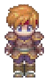
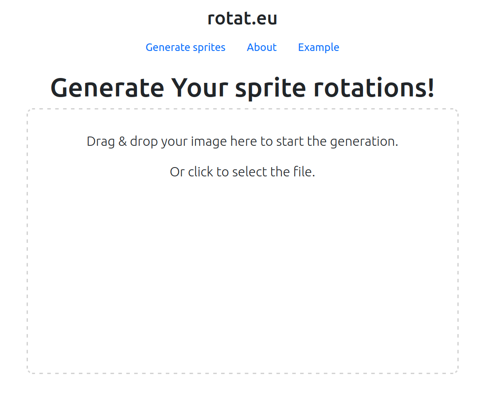
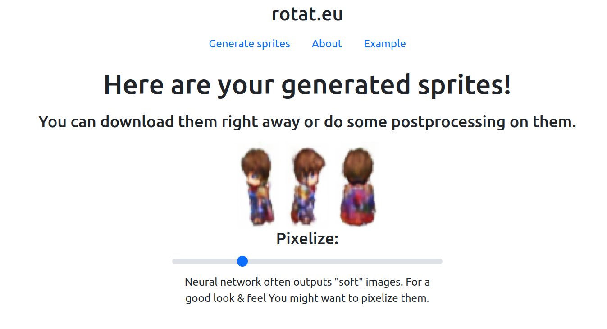

# rotat.eu
A neural network and web frontend for generation of game sprites rotation.


# What is this software?
rotat.eu is a software that makes the development of game sprites easier. Typically, for a 2d over-the-head view, 
one has to create four sprites for character rotation (front, left, right, back). This software aims to shorten this process - 
now You only need to create the front of Your character, and the other rotations will be generated for You.

* How well does it work?  
It works "decently" - You can tell that the rotation has style similar to the input, but not all styles of images
are nicely generated.  
Here is an example of an input image, and what the neural network outputs:  
(Sample images taken from https://www.rpgmakerweb.com/blog/resource-spotlight-dark-fantasy-tall-sprites)  
Input image:  
  
Generated outputs:  
  

Considering the neural network only looks at the front of the image, the result is quite satisfying.

# Web front
This software provides a web front for accessing the API via nginx and dynamically passing the result to the user.  
This is an example of the upload page:  
  
And an example of the result page:  



* How does it work?
The input image from the user is sent to the API server, which enqueues for processing. Next, the user awaits for the result in the queue,
ocasionally requesting the server for the result status. When the result is available, It is sent to the user and displayed in the browser.

The app itself is separated into two parts:  
   * A web front, made purely with JavaScript & Bootstrap, for uploading & downloading the files from the API server,  
   * an api server, which processes the requests in parallel.
   
# How to use the api?
The api supports three routes:  
```
POST    /api/enqueue                            controllers.EnqueueController.enqueue()
GET     /api/queue/:accessKey                   controllers.QueueController.checkQueuePosition(accessKey: String)
GET     /api/getResult/:accessKey/:rotation     controllers.ResultController.getResult(accessKey: String, rotation: String)
```

The post request should contain the input file in the form data (see the index.js script for details on how to send such a request),
and returns the access key for the output.  
Once the access key is received, one has to use the /queue call in order to get the current queue position. When it reaches zero, 
the result can be retrieved.   
After the position in the queue changes to zero, You can get the result rotation by accessing the /getResult route, where rotation is one of "left", "right" or "back".
   
# How can I set it up?
The API & web front use nginx to serve HTML and API at the same port. To run the nginx server, enter the main directory (the directory of the nginx.conf file), and run the
following command:  
```sudo nginx -c ${PWD}/nginx.conf -p ${PWD}```  
The nginx configuration file should be changed to match Your preferences.

Then, run the server using scala build tool (tested on Scala 2.3.8).  Enter the server/rotat_io_api directory and issue the ```sbt runProd``` command to run the server.
You are now ready to use the application.


# How fast is it?
The server itself is implemented in a concurrent, non-blocking way that requires the user to poll for the result. Eight threads process the request on the server-side and with some 
testing I can tell that it runs quite well. The TensorFlow inference is also done with the new experimental TensorFlow JVM API, which is quite great, although at this time a bit underdocumented.


# Model structure and how was it trained
The model is a modified version of the U-net architecture, with a common encoder for all rotations, but separate decoders for each. It is quite a bit model and is probably
undertrained, since creating a dataset for this task is mundane and hard. I did a lot of hand scraping to get this kind of result. The input data format is a grid of rotations,
where each column is a multiple of four images (front, left, right, back).
